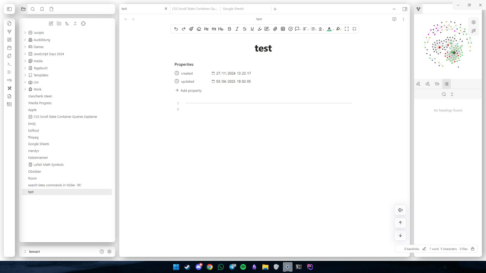
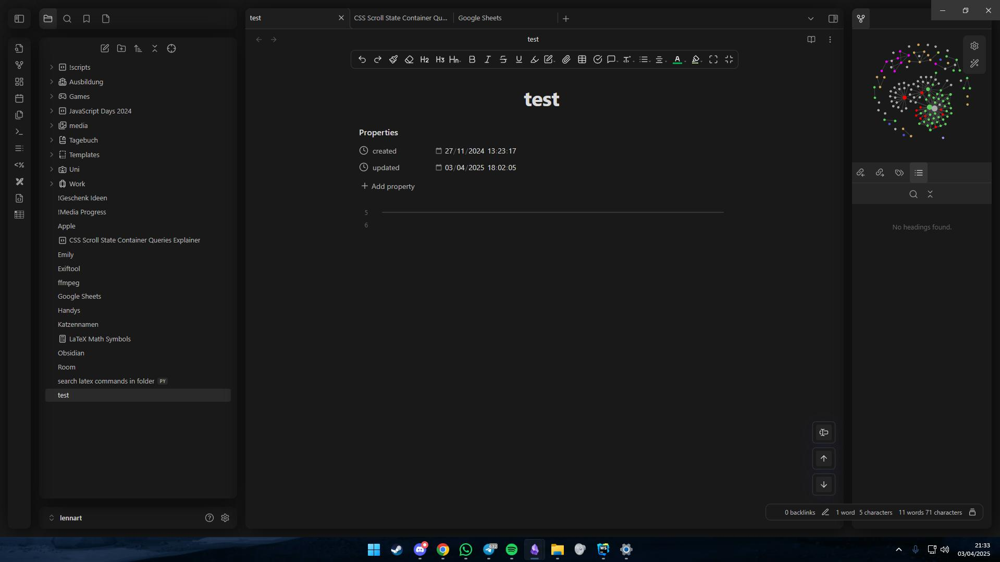

# Neumorphism Theme

Welcome to the **Neumorphism Theme**, a custom theme for Obsidian that brings the modern and tactile Neumorphism design to your note-taking experience. This theme features soft shadows, subtle highlights creating a visually appealing and functional workspace with a minimalist aesthetic.

## Features
- **Neumorphic Design**: Tactile UI elements with soft shadows and a 3D "pressed-in" or "raised" effect.
- **Minimalist Color Palette**: Monochromatic tones with subtle contrasts for a distraction-free environment.
- **Enhanced Readability**: Optimized typography and contrast for comfortable reading and writing.
- **Customizable**: Easily tweak the CSS to suit your preferences.

## Preview

## Troubleshooting
If your issue isn’t listed here, feel free to open an issue in the repository, and I’ll do my best to assist!

---
Enjoy a modern and tactile note-taking experience with the Neumorphism Theme!